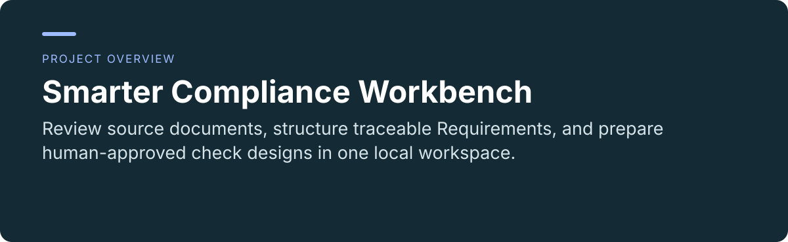
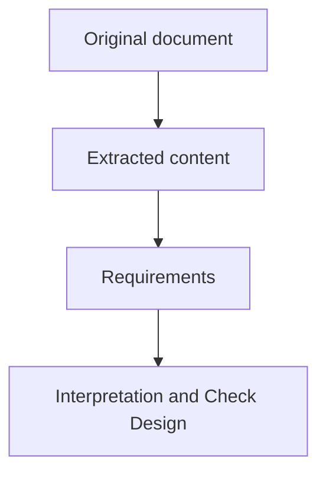

 

# Smarter Compliance Workbench

**Review source documents, structure traceable Requirements, and prepare human-approved check designs in one local workspace.**

[Project usage and maintenance](../README.md) · [Report an issue](https://github.com/thejaytang/smarter-compliance-aquaculture/issues)

## 1. What you can do

- Keep original wording beside extracted content, Requirements, and Interpretation & Check Design.
- Retain saved versions and reviewer history, and exchange work through explicit package review.

## 2. Start here

Start with the [project entry](../README.md), then follow [installation and recovery](../ENVIRONMENT.md). After setup, use the launcher for your operating system. For a complete law with saved work pending human review, read the [permanent Example](../workbench/resources/examples/README.md).

## 3. Use cases

These are illustrative scenarios. Only explicitly linked execution artifacts represent checks performed for this update.

| Input or request | Expected result |
|---|---|
| A source excerpt | A Requirement linked to its source location and saved review work |
| A saved Requirement revision | Version-bound Scope, Conditions, Demands and check-design text |
| A colleague’s saved-work package | A comparison and explicit import decisions |

## 4. Requirements and current limits

Local browser application with Windows and macOS deployment instructions. Python 3.12, uv and Git are required for setup. Native platform checks must follow the environment guide. Saving, reviewing and adopting a suggestion are separate actions. Check designs are not executed compliance results. Unconfigured processing remains Not connected. GitHub presentation pages are bilingual; maintained operating and engineering guides remain English.

## 5. Documentation and sources

These links identify the implementation, operating instructions or related projects for a closer fit check.

- [Daily workflow](../USER_GUIDE.md)
- [Source semantics and review](../workbench/contracts/review-workflow.md)
- [Storage and exchange](../workbench/contracts/storage-and-exchange.md)

## 6. License and maintenance

No repository-wide license is declared at the root. This presentation update does not change the terms of code, data or third-party material; confirm permission for the material you want to reuse.

This is the public introduction. Linked project documents remain authoritative for operation, constraints and maintenance. Presentation updated: 2026-09-22.
