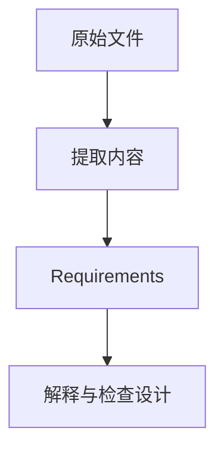

 

# Smarter Compliance Workbench

**在本地工作区审阅来源文件、组织可追溯的 Requirement，并形成人工确认的检查设计。**

[项目使用与维护入口](../README.md) · [报告问题](https://github.com/thejaytang/smarter-compliance-aquaculture/issues)

## 1. 能完成什么

- 将原文、提取内容、Requirement 与 Interpretation & Check Design 并排查看。
- 保留保存版本和审核人历史，通过明确的资料包审阅交换工作。

## 2. 从这里开始

先读[项目入口](../README.md)，再按[安装与恢复指南](../ENVIRONMENT.md)完成设置，使用对应系统启动器。学习流程可先读[完整法条及待人工审核的永久例子](../workbench/resources/examples/README.md)。

## 3. 使用场景

以下为说明性场景；只有明确链接的运行产物才代表本次检查结果。

| 输入或请求 | 预期结果 |
|---|---|
| 来源片段 | 关联原文位置的 Requirement 与保存后的审核工作 |
| 保存后的 Requirement 版本 | 绑定该版本的 Scope、Conditions、Demands 与检查设计 |
| 同事的工作资料包 | 差异对照与明确的导入决定 |

## 4. 使用条件与当前边界

通过浏览器使用的本地应用，提供 Windows 和 macOS 部署说明。设置需要 Python 3.12、uv 和 Git；原生平台检查应遵循环境指南。保存、审核和采纳建议是不同操作。检查设计不等于实际执行的合规结果。未配置的处理能力保持 Not connected。GitHub 展示页采用双语，持续维护的操作与工程指南仍使用英文。

## 5. 资料与来源

下面链接指向实现、操作说明或相关项目，便于进一步判断适用性。

- [日常工作流程](../USER_GUIDE.md)
- [来源语义与审核](../workbench/contracts/review-workflow.md)
- [存储与交换](../workbench/contracts/storage-and-exchange.md)

## 6. 许可与维护

仓库尚未在根目录声明统一许可证；本次展示更新没有改变代码、数据或第三方材料的许可。复用前请确认对应材料的授权。

本页为对外介绍。具体操作、约束和维护说明以链接的项目文档为准。展示页更新：2026-09-22。
