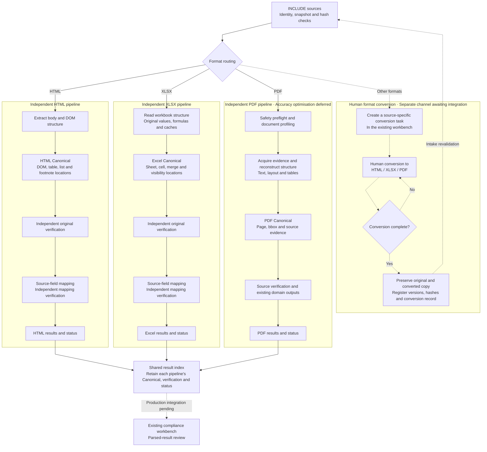

# Three Format Pipelines and Human Conversion

Processing design confirmed by the user on 2026-09-08. HTML, XLSX and PDF each have a complete internal pipeline,
preserving Canonical artifacts, original-format locations and verification evidence before joining the result index. Only INCLUDE sources are processed.
Solid arrows show successful paths in existing pipelines; dashed arrows show human-conversion and workbench channels awaiting integration.
Any failure preserves its cause and existing evidence immediately, without generating successful downstream artifacts.

## PDF pipeline detail

The overview above intentionally compresses PDF processing. The [four-page Canva diagram set](https://www.canva.com/design/DAHUmF-8SUQ/edit) separates the format overview from PDF page/region routing, fine table/cross-page processing, and evidence/Canonical/review. Text remains editable; connector graphics preserve the checked positions. This version supersedes the crowded whiteboard rejected by the user. It is an explanatory visual, not parser-accuracy or production-integration acceptance.

| Level | Existing processing and conditional branches | Implementation reference |
| --- | --- | --- |
| Page evidence | Check native word count, character quality, valid coordinates and embedded bitmaps. Route each page to `native`, `ocr`, or `native_with_visual_fallback`. One document can contain all three routes. | [Text-layer routing](../../src/pdf_extraction/routing/text_layer.py) |
| Layout and regions | Identify reading order, repeating margins, heading/list structure and content regions. Preserve page, bbox, crop and native references. Embedded bitmaps receive visual-region handling; figure OCR remains configurable. | [Pipeline](../../src/pdf_extraction/orchestration/pipeline.py), [native visual regions](../../src/pdf_extraction/layout/native_visuals.py) |
| Tables | Use learned Requirement templates, ruled-grid geometry or configured complex-table backends. Recover rows, columns and merged cells; align source words, retain ancillary text and check omissions. Empty cells, and low-confidence cells in supported proposal paths, can receive local OCR. | [Table parser](../../src/pdf_extraction/parsers/table.py) |
| Assembly | Reconstruct paragraphs and hierarchy. Score cross-page table candidates using geometry and content signals; preserve uncertain merge candidates for review instead of unconditionally joining tables. | [Table assembly](../../src/pdf_extraction/assemble/table_assembler.py) |
| Conflicts and focused rereads | Compare available native/OCR evidence and critical text spans. Optional precision review crops and enlarges the relevant region; unresolved evidence retains review or abstention. Reusing the same OCR backend does not create independent verification evidence. | [Precision review](../../src/pdf_extraction/reconcile/precision_review.py) |
| Canonical and verification | Preserve structured facts and provenance, run structural/source checks and retain domain outputs, reports and review items. Machine evidence depth and human-review policy remain separate. | [Finalization](../../src/pdf_extraction/orchestration/finalization.py) |

The full engine and the governed intake adapter have different capability limits. The current [PDF intake adapter](../../src/pdf_extraction/formats/pdf.py) requires an explicit 1–4-page window and restricted local configuration. The [positioned intake configuration](../../config/pdf-intake-positioned.yaml) disables complex-table model routes, formula transcription, precision review and external models. A code path existing does not mean that every run enables it. Figure OCR is also conditional, not an automatic consequence of a mixed page.

The shared result index and workbench review belong outside all three format pipelines. Other formats retain the separate human-conversion route. PDF accuracy improvement remains deferred; creating this visual does not restart PDF experiments.

## Human-conversion boundaries

- Other formats, such as legacy XLS, Word, CSV and images, enter a dedicated human-conversion channel.
  This is a task type in the existing workbench, with no separate human interface or repeat of source INCLUDE decisions.
- The converted file is a source-linked parsing copy. It must not overwrite the authoritative original or claim to be the official published format.
  Preserve both identities, versions, hashes, conversion operator/time/method and completeness results.
- A human chooses one of the three target formats based on the content. Unfaithful conversions, unreadable text or omissions remain pending;
  changing an extension or forcing completion cannot bypass verification.
- Revalidate source lineage and format before routing a converted copy. Machine success still follows the existing human-review policy.
- Missing body text or corrupt originals in supported formats are source-completeness issues; parsing errors belong to their pipeline.
  Do not recategorise them as other formats. For example, a Lovdata directory page needs the complete source; conversion cannot generate missing clauses.

## Implementation state and next experiment

The three parsing branches exist within one modular monolith, not three separate services. This diagram defines responsibilities
and artifact flow. Existing PDF domain construction is staged internally; the diagram does not require rearranging verified calls.
Unknown formats currently return unsupported, and legacy XLS returns not implemented. Human conversion tasks, converted-file registration,
completeness confirmation and re-entry remain unimplemented. See [System2 state](../../PROJECT_STATE.md).

Next, define conversion tasks and receipts in the existing workbench interface design and validate a traceable round trip for one INCLUDE
unsupported-format original and its human-converted copy. Until the interface exists, do not fabricate source state or change the Snapshot
contract to admit unregistered conversions. Source gates remain in the [intake contract](../contracts/source-intake.md).
