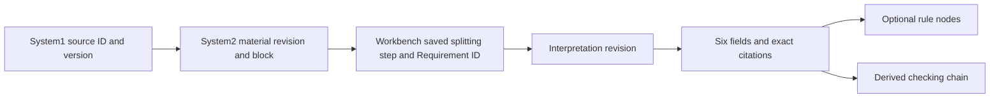

# Requirement annotations and check design

## Entry identity and Exception clarification

The current [entry and toolbar contract](manual-requirement-splitting.md#entry-identity-and-selection-toolbar-current) owns display numbering and source interactions. The fourth pane shows one Rx per source entry. Historical internal identities and interpretations remain accessible within their owning entry.

Negation remains in the exact selected wording; Conditions has no independent NOT authoring control. No operator is inferred from words such as “not” or “unless”. Exception is a separate full-clause or Requirement-reference relationship. Source projection carries its complete branch under an explicit separate-scope description; exception subjects are not folded into the main Scope, and no missing exception demand is invented. This supersedes the earlier automatic conversion of exceptions into negated conditions. All new NOT operations are rejected. Historical stored negation remains readable in recorded structure projections; it is not silently removed or recomputed.

## Unified group handoff (current)

The [source-bound group editor](manual-requirement-splitting.md#unified-source-bound-groups-current) supersedes the earlier terminal grammatical fields and separate exception operation. Source-derived Scope, Conditions and Demands retain clause labels, subject/object associations, shared outer conditions, exact/range quantities and source negation wording (plus read-only historical NOT where already saved). An empty group or unset QC is an unresolved input, never unconditional applicability. This remains a human-authored check design, not an executed compliance result.

`requirement-structure/1` is an additive splitting extension. Immutable saved steps own it; `requirement_structure_nodes` indexes owner, parent, position, kind, role, quantity, negation, source offsets, reference target and exception provenance. Response-only `structure_views` lets legacy records use the same editor without saving a migration. Canonical trees replace legacy field/relationship projections only for the affected unit.

Interpretation context and its fingerprint include effective trees across linked sessions. Saved checking logic binds the effective source tree. Full-workspace packages containing any group history use the nested `requirement-delivery/2` contract; unchanged legacy-only bundles use `/1`. Import supports both, validates source spans/counts/ownership/cycles and rejects a tree disguised as `/1`. Older clients must reject `/2` rather than silently flatten its meaning. The surrounding workspace ZIP remains version 2.

All edits still require explicit Save. Opening a record, selecting text, changing disclosure or previewing an edit adds no database history. The three editable Logic boxes and explicit AI candidate acceptance remain unchanged.

## Simplified relationship and interpretation workflow, 2026-09-16

This revision supersedes the earlier separate relationship buttons and six-field status menus. Subject, Modal Verb, Main Verb, Object, conditions, exceptions and subrequirement use the same coloured field-block layout. A Condition editor contains only recursive conditions, not grammatical fields or other relationship types. Exact/range counts are displayed directly in every relationship group, including nested groups; scalar k still means exactly k.

Exceptions and subrequirements can reference another whole top-level Requirement in the current material through its R number. Header numbers, card labels, source chips, reference choices and the fourth-pane list share a material-wide display numbering scheme. Persistent references remain UUIDs; display numbers are not database identities and can change when the material's structure changes. An entry with several roots displays each root number.

The fourth pane lists Requirements as collapsed Rx entries when none is selected. Selecting either pane synchronizes the other. Each opened entry shows source-derived Scope, Conditions and Demands followed by one editable Logic text box per group. The projection uses recorded Subject wording, conditions/exceptions with their quantities, and modal/main verb/object/subrequirements. It preserves nested structure and does not infer unstated semantic predicates or deadlines. Missing assignments are shown as missing, never unconditional applicability. Save the third-pane decomposition before generating or saving the associated interpretation.

AI suggestion operates on one Logic field. Its button becomes Generating, then Accept and Regenerate; the candidate appears in the editable text box. Accepted content and pending candidates remain separate. Edits made while generating are retained alongside the returned suggestion. Unaccepted candidates must be resolved before formal save. Saving does not disable typing; edits made after the save snapshot remain unsaved. Explicit Save is still required; leaving with edits warns before discarding. Source evidence, gaps, review and history remain under details. No real model is configured by default.

The existing six-key persistence contract remains: scope/condition/demand store the source projection on explicit Save; scope_information/condition_information/verification store the three accepted Logic values. Historical records remain unchanged. No schema migration or automatic save is introduced.


## Latest interaction revision, 2026-09-16

This section supersedes earlier autosave and second-pane annotation descriptions below. Unsaved splitting and interpretation changes stay in page memory only. Splitting steps are validated as previews; **Save splitting** or **Save & collapse** commits their final version. **Save interpretation** commits fourth-pane fields. Leaving warns about unsaved work. Earlier saved histories and legacy recovery records are retained, but new edits are not automatically journalled in the browser or database. Semantic colours render over the exact source at the top of each third-pane entry, including when collapsed. Conditions can be decomposed recursively, and one entry may reference multiple source blocks. Second-pane Current text and Changes remain separate from this coloured preview.


## Workflow

The material workspace has four independently scrolling panes: Original document, Extracted content, Requirements, and Interpretation & check design. Collapse a pane from its header; the same rail restores it. Drag separators or use arrow keys (Shift for larger steps). Narrow screens retain horizontal scrolling.

1. Save material text, then split a passage in Requirements. Assign exact source selections to fields and relationships.
2. **Finish & collapse** saves the unit and displays its completed field ranges in **Requirement annotations**. Other completed units remain visible. **Resume unit editing** removes that unit's completed marks; finishing restores its current ranges. Unmarked text is not a claim of complete parsing.
3. The Read selector switches between **Current text**, **Changes**, and **Requirement annotations**. Changes retains red strikethrough deletions and green additions. Reading modes do not save or review anything. Markdown editing retains the existing source/baseline behavior.
4. Activate an annotated fragment by mouse, Enter or Space to locate its splitting field. Overlaps list all referenced field/unit identities. **Locate text** returns to the source passage.
5. Select a saved Requirement card. Fill the two fields in each Scope, Condition and Demand group. Record explicit source quotations, proposed interpretations and unresolved questions separately.
6. **Checking Logic** updates from these six fields. It identifies A, filters applicable B within A, and describes checking B against Demand/evidence. C, when displayed, means objects with sufficient evidence of meeting Demand in the same assessment context. `B ⊆ C` is a design criterion, not a computed result. Unknowns, original exception ownership and source combinations remain visible. No operators are guessed from prose; fixed `k` and inclusive `[min,max]` semantics remain unchanged.
7. **Save interpretation** preserves a separate version. **Mark interpretation reviewed** is a later explicit action, blocked while fields or gaps remain unresolved. Neither action confirms or archives material content.

Working copies are automatically saved in a separate reviewer-bound SQLite record and a browser recovery journal. Leaving a material does not require formal submission. **Interpretation drafts** in the material list, or **Resume interpretation drafts** in an empty fourth pane, lists resumable work; **View working copy** also exposes retained text for a retired Requirement. Concurrent working copies require an explicit comparison. A formal save atomically retires only the matching working-copy revision. Formal save, candidate adoption and review remain separate. Uncertain requests keep their idempotence identity.

Each field has `state`: `specified`, `not_stated`, or `unresolved`. Older fields derive this state from their value and basis. `not_stated` requires an empty value and an `absence_reason`; it can complete an extraction review without claiming the requirement is executable. The checking chain still displays an information gap, and a missing Condition never becomes an unconditional filter. Source absence is a human assessment of the reviewed context, not proof that no applicable law exists.


## One shared API in Settings

Open the reviewer/Settings menu and choose **AI service**. Supply the complete OpenAI-compatible Chat Completions URL, model and API key, then save. There is no default service or model. A blank key keeps the saved key; Remove saved key explicitly clears it. The setting is shared by this installation, not duplicated in each pane. Optional `WORKBENCH_AI_API_KEY` is a server environment fallback. The Settings form supersedes the earlier environment-only configuration proposal.

The key is saved only in `workbench/runtime/ai-provider.json`, created with private file permissions on POSIX; it is never returned by the settings API, placed in browser storage, logged, or included in collaboration/recovery packages. Protect the runtime directory using the operating system's normal account permissions. Windows backend/frontend tests run in CI; native desktop interaction and deployment-specific directory permissions remain unverified.

Saving configuration does not test the connection or call a model. Before configuration, generation shows **Not connected**. Configured means settings are present, not proven provider availability. This adapter powers interpretation suggestions; it does not enable the unavailable automatic Requirement extractor or Site Model engine. Legacy provider example files are retained as inactive compatibility/design artifacts, not additional Settings forms.

Generation is explicit. A confirmation displays the destination, model and complete material/version list. The context includes the selected requirement, connected splitting, full saved material blocks, saved/original document information when available, and explicitly selected accessible local related materials. Customer-confidential sources are blocked based on their governed source metadata. Nothing is researched online. If complete context exceeds the configured UTF-8 byte limit, generation fails before transmission; nothing is silently truncated.

All six candidates or a single field may be generated. Candidates include quotations, basis and gaps. They never replace formal edits automatically. **Use suggestion** previews replacement of existing content; adoption remains editable. A regenerated candidate does not change earlier formal edits. The server validates shape and exact quotations; this does not establish semantic correctness. Provider redirects are rejected and provider errors are sanitized. Timeouts, invalid citations, interrupted requests and stale context retain saved work.

## Data and interfaces

- `requirement-interpretation/1`: actor, material and Requirement ID, splitting revision, context fingerprint and manifest, six fields, citations, gaps, reviewed status, deterministic derived logic.
- SQLite tables: `requirement_interpretations`, `interpretation_history`, `interpretation_requests`, `interpretation_runs`. Added alongside existing Requirement tables in the existing Workbench database. No System3 service or environment is added.
- `GET /api/requirement-annotations?material_id=…`: current reviewer's read-only completed-span projection, plus stale sessions. Source offsets use Unicode code points. Markdown token projection checks canonical source equality and refuses uncertain mapping. Nested spans keep the inner field background and outer borders; ambiguous equal/crossing ranges are neutral overlaps.
- `GET /api/interpretations?unit_id=…`, `GET /api/interpretations/run?id=…`.
- `POST /api/interpretations/context`, `/save`, `/generate`. Save includes request UUID, expected revision and context fingerprint. The server regenerates logic, appends history, enforces reviewer ownership and rechecks splitting revision. Review/restore use the same guarded save route.
- `GET/POST /api/settings/ai`: sanitized shared configuration read / version-checked save. Secrets are write-only to the browser.

The ordinary consistent database recovery path includes splitting, interpretations, candidates and their histories. Version-2 full collaboration ZIPs now include saved splitting and interpretation work, as described below. Older work/result package formats are unchanged. Working copies are local and excluded from collaboration export; formal Save is required to deliver them. API credentials are excluded from both export paths.

## Global field palette

`four-pane.css` owns shared semantic tokens: Subject pink-purple; Modal Verb blue; Main Verb green; Object orange; conditions purple; exceptions red; subrequirement teal. Pane 2 marks and pane 3 fields use these tokens, with visible labels and focus descriptions. Scope, Condition and Demand use neutral group styling rather than implying a grammatical one-to-one mapping.

Validation evidence and known limits: [current report](../../project-support/four-pane-20260916/RESULTS.md).

## Versioned provenance and relational joins

Each saved interpretation revision now has an append-only projection in the same SQLite database:

`interpretation_history → interpretation_origins → interpretation_fields → interpretation_citations`

`interpretation_origins → interpretation_rule_nodes → interpretation_fields`

Origins also reference the exact `(session_id, revision)` in `requirement_steps`. The parent is immutable splitting history; deleting or combining an active unit cannot erase its saved evidence. Origin rows retain reviewer, Requirement ID, material and splitting versions, source descriptor/hash, block ID, chapter, code-point range and source text. The System1 original descriptor and System2 material remain their owning authorities; no duplicate writable legal text is introduced.

The Workbench SQLite connection enables foreign keys. A save atomically appends history and its relational projection, then commits the idempotence receipt. Fields, citations and rule nodes cannot exist without the owning saved revision. Legacy histories are indexed on first read from the exact saved splitting step. Citations whose original block metadata was not historically stored are labelled `legacy-unlocated`; they are never joined to today's paragraph merely because wording matches.

`GET /api/interpretations/trace?unit_id=…&revision=…` returns the requesting reviewer's saved trail, including retired units. Source edits make current interpretations require review but never rewrite the old trail. A quotation receives code-point `start` and `end` only if explicitly valid or uniquely present in its cited block. Repeated quotations retain an unresolved position until supplied explicitly. Block identity remains known. History restoration appends a new interpretation revision with currently validated references.

Generation runs are indexed by reviewer and Requirement ID. Opening one interpretation reads at most ten associated runs instead of scanning/deserializing the reviewer's complete request history.

## Optional QueryBuilder handoff

The six human explanations remain the primary editing workflow. **Site Model mapping · optional** provides explicit nested AND/OR comparisons without deriving them from prose. Each leaf has a stable ID, `field`, `operator`, typed `value` and an `interpretation_field` link. This link joins through the saved revision to that field's citations and the Requirement origin. Group nodes retain their parent and section (Scope, Condition or Demand).

The `requirement-check-design/1` contract contains three nullable groups. `null` means **unmapped**, not true and not an empty set. The server validates structure, types, identifier syntax, bounds, unique IDs and supported operators. Negation uses a supported negative comparison; unsupported group negation, quantifiers and event joins must remain unresolved rather than being approximated. Existing source quantity and exception structures remain separate and intact.

A sanitized `querybuilder` projection in the interpretation response uses the documented `condition` / `rules` / `field` / `operator` / `value` shape. An on-demand preview supports handoff. This references the [SQLAlchemy QueryBuilder contract](https://sqlalchemy-querybuilder.readthedocs.io/en/latest/) and [jQuery QueryBuilder rules](https://querybuilder.js.org/), without adding either library to the local runtime. SQLAlchemy QueryBuilder itself does not validate rule syntax. The downstream service must additionally resolve its allowlisted model fields, joins, types, event context and evidence sufficiency. These independent filters do not execute a Site Model query, compile quantity semantics, or establish `Satisfied`.

## Reduced daily controls

Selecting a saved Requirement card loads its fourth-pane interpretation without reopening splitting fields. The six values are visible; **Evidence & gaps**, AI candidates, source structure, history and mapping expand only when needed. Entering a manual nonempty value with no recorded gap marks it as a proposed interpretation, never as source proof. Quoted-source status still requires valid references. **Source trail** shows the fixed saved lineage. Save remains distinct from review and is pinned at the bottom of the pane; Ctrl/Cmd+S inside this pane saves its interpretation. Material-level Save retains its own scope.

### Ownership across databases

Workbench foreign keys cover interpretation history, fields, citations, rule nodes and saved splitting steps in its own SQLite database. System1 source authority and System2 material history remain in their owning databases. Their links are stable identifiers plus saved revisions, source fingerprints and passage coordinates, validated through the owning adapters before a write; SQLite does not enforce a cross-database foreign key. The immutable origin snapshot keeps the historical reading available without resolving it against current text.



A Scope value can be joined to its saved passage without matching prose:

```sql
SELECT f.value, o.unit_id, o.session_revision, o.source_id,
       o.material_id, o.material_revision, o.block_id, o.start, o.end
FROM interpretation_fields AS f
JOIN interpretation_origins AS o
  ON o.actor=f.actor AND o.unit_id=f.unit_id AND o.revision=f.revision
WHERE f.actor=? AND f.unit_id=? AND f.revision=? AND f.field_key='scope';
```

The source snapshot is evidence of which version was interpreted. It does not establish that the legislation is still current or the extracted passage is semantically complete. Missing original assets, ambiguous citations and unresolved Site Model mappings remain visible limits.

## Continuity, catalogs and change review

- `GET /api/interpretations/drafts[?unit_id=…]` and `POST /api/interpretations/draft`: isolated working copies with their own revision and idempotence receipt. These are not formal interpretation revisions. Discard uses a revisioned tombstone, preventing an old autosave from resurrecting discarded text.
- `GET/POST /api/settings/site-catalog`: one local `site-field-catalog/1` with no invented defaults. **Settings → Site Model fields** edits human labels, explicit `table.column` mappings, types, descriptions and allowed comparisons. Rule controls select these fields and derive their types. Configured catalogs are validated during formal saves; a catalog version is pinned with the interpretation. Imported catalog evidence does not replace local configuration.
- Saved interpretations retain frozen `context_snapshot` evidence. **Review changed sources** lists affected interpretations in the current material. The selected interpretation shows before/current passages, affected fields, rule IDs and links to the fields. Changes to uncited context remain a contextual review task; the system does not infer semantic irrelevance. Legacy versions without complete snapshots require a full contextual review.
- `GET /api/interpretations/impacts?material_id=…` returns this material-level list for the current reviewer. Each interpretation read also includes `impact` and `mapping_issues`.

## Full workspace delivery, version 2

`full-workspace-snapshot/2` retains the previous source/material/history contract and adds one `requirement-delivery/1` bundle per named reviewer. It carries source-exact splitting sessions and steps, relationships and quantities, interpretation histories, formal six-field values/states, citations and immutable origins, optional typed rules, pinned catalog evidence, review attribution and saved candidate runs. It does not include working copies, shared API credentials, active provider configuration or schedules. Original source files continue through the existing verified original-file inventory.

The importer validates the graph, source spans, field anchors, quotation support, exception/count structure, interpretation parent revisions and non-executable derived logic before preview. Concurrent Requirement bundles are atomic choices, preventing unsafe structural auto-merges. Import keeps the original reviewer identity; select that reviewer to resume their work. It never transfers their review declaration to the importing reviewer. Source/material imports precede Requirement data.

Received artifacts are retained by digest. Conflicting local revision numbers are rebound to appended local history while the untouched incoming artifact remains in `requirement_delivery_archives`; original revision identity is recorded in `delivery_origin`. Request receipts make interrupted imports replayable. Existing histories and omitted sessions remain. An imported interpretation whose local dependencies differ remains stale and requires context review. No import executes a query, generation request or compliance check.

Version-1 full snapshots are readable; older Workbench versions must be updated to consume version 2. Legacy quotation locations retain their original limitations. A full snapshot preserves recorded work, not a guarantee that an old missing attachment was present in the first place.

## Compact quantity controls

Each relationship group displays QC, a live scalar or inclusive range, All / Any / Only / Not All, and MIN-MAX. With N direct items these presets mean N, [1,N], 1 and [1,N-1]. Not All is the user-defined nonempty proper subset range, disabled below two items. Numeric bounds are limited to 0..N and MIN cannot exceed MAX. A nested group counts once. Formula tooltips retain non-colour meaning.

Range changes remain page-memory drafts until explicit Save splitting. Enter or leaving a row updates the unsaved preview; invalid pairs prevent submission. Escape restores that row. Pending input survives rendering and triggers the existing leave warning. No automatic database/history save is introduced.

## Query logic consolidation requested (pending implementation)

Fourth-pane Conditions logic should expose nested QueryBuilder AND/OR rules and explicit group NOT, separately from verbatim source-derived Conditions. The third-pane removal of NOT authoring applies to source annotation only. The current implementation still has prose Logic fields and a separate optional Site Model mapping editor; it does not yet implement this consolidation or group NOT. Preserve existing prose, adopted candidates and history when introducing structured editing. Do not infer Site Model field bindings or flatten exact/range quantities into AND/OR.

Recommended simplified surface: each Scope/Conditions/Demands section owns its source quote and rule editor; keep Sources as collapsed provenance, Checking chain as automatic read-only preview, explicit Save, and collapsed History. Remove the duplicate bottom mapping editor only when its capability is available in the sections. Keep AI configuration in Settings and disclose material scope at generation. Review remains distinct from saving. QueryBuilder's not-group extension requires a validated export adapter; upstream SQLAlchemy QueryBuilder documentation alone does not prove support for that extension.

## Shared saved work (2026-09-17)

The latest user revision supersedes actor-private visibility for saved splitting and interpretations. On peer installations every named reviewer can read and edit the same saved Requirement graph. Immutable source bindings, version-conflict checks, explicit saves and review declarations remain. The original actor key is a stable storage/provenance key; `edited_by` plus each history timestamp records the actual editor. Unsubmitted page drafts remain local and do not become history.

Shared exports use `requirement-delivery/4`, `requirements:shared`, and an explicit session-owner map, retaining cross-author reference evidence, histories, candidate request authors and group semantics. Source-bound personal content revisions remain distinct; reconcile source differences before editing an annotation. Version 1–3 bundles can seed an empty Requirement store but must be re-exported by an updated app before merging over existing shared work. Conflict previews render fields, nested quantities, relationships and links rather than raw JSON.
